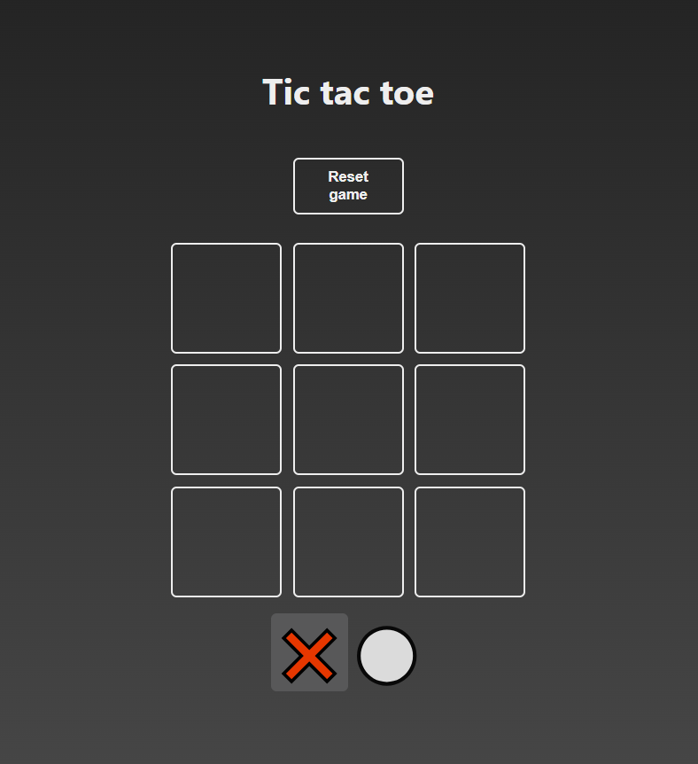

# Tic-tac-toe
## ReactJS / JavaScript

<br>

<div align="center">
  
</div>

<br>

<div>

    The game of Tic Tac Toe, also known as Three in a Row, is played between
    two players, "X" and "O", who take turns marking spaces on a 3x3 grid.

    The player who manages to place three of their marks in a horizontal,
    vertical, or diagonal row wins the game.

    You can play this game locally, with a family member or friend.
    What are you waiting for? Give it a try!

</div>

<br>

**DEPLOY**:
<br>
https://ks-tic-tac-toe-react.vercel.app

<br>
<br>

# Index

1. [Project Title and Deployment Link](#tic-tac-toe)

2. [Features](#features)

3. [Technologies and Tools used](#technologies-and-tools-used)

4. [Project Setup](#project-setup)

5. [Contribution](#contribution)

<br>

## Features

<div>

    ✔️ Play the game as many times as you want

    ✔️ Game saving and data persistence

    ✔️ TIE checking

    ✔️ Reset game

    ✔️ Play again

</div>

<br>

## Technologies and Tools used

<div align="center">
  <br>
    <a href="https://reactjs.org/" target="_blank" rel="noreferrer"> </a>
    <a href="https://developer.mozilla.org/en-US/docs/Web/JavaScript" target="_blank" rel="noreferrer"> </a>
</div>

<br>

## Project Setup

```sh
npm install
```

### Compile and Hot-Reload for Development

```sh
npm run dev
```

### Compile and Minify for Production

```sh
npm run build
```

### Lint with [ESLint](https://eslint.org/)

```sh
npm run lint
```

<br>

## Contribution

If you want to contribute to this project, follow these steps:

1. Perform a fork to the repository.

2. Create a branch for your feature or bugfix: `git checkout -b feature/your-feature-name`

3. Make the necessary changes and commits:  `git commit -m 'Add some feature'`

4. Push to branch: `git push origin feature/your-feature-name`

5. Send a pull request to the original repository.

<br>

## Project Status


<br>

## Project Developer

| [<br><sub>Kevin Schans</sub>](https://github.com/KevinVanDerSchans) |
:------------------------------------------------------------------------------------------------------------------------------------------: |
